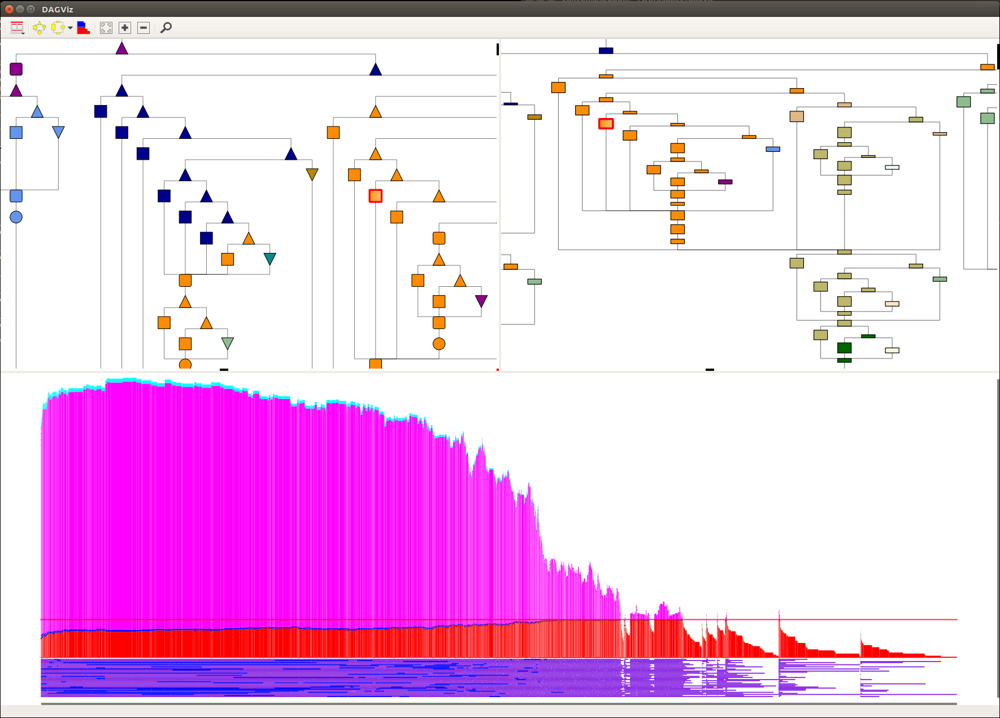

DAGViz
======

A DAG visualization and analysis tool for task parallel applications
based on the computation DAG traces captured from their executions.

DAGViz's GUI was first implemented in C language with the GTK+ toolkit,
but then it is changed to Qt5 framework with its Python bindings PyQt5.
So there are currently two versions: *dagviz-gtk* and *dagviz-pyqt*, and the
default one *dagviz* is symlinked to the newer *dagviz-pyqt*.
Qt-based version is easier to be installed and used on other platforms
(e.g., macOS, Windows) rather than the Ubuntu Linux on which it is
originally developed.



Besides the dependencies on the GUI toolkits, DAGViz also depends on MassiveThreads
for reading the format of the DAG trace files which are recorded by DAG Recorder -
a tracing module included in MassiveThreads.

GTK-based version and Qt-based version can be built separately and independently.
The newer Qt-based version is recommended.
More detailed installation instructions are provided below.


DAGViz-GTK
-----

DAGViz-GTK is written totally in C language with the GTK+ toolkit.

### Dependencies

1. MassiveThreads: https://github.com/massivethreads/massivethreads
2. GTK+ 3: https://www.gtk.org/download (libgtk-3-dev package on Ubuntu)


There are other optional packages for reading sampling-based traces
if necessary:

- libunwind: for getting call chains
  Ubuntu 14.04: libunwind8-dev package

- libbfd: for dagviz to read binary file.
  Ubuntu 14.04: binutils-dev package

### Quick start

```bash
$ git clone git@github.com:zanton/dagviz.git
$ cd dagviz
$ make gtk
$ ./dagviz-gtk
```


DAGViz-PyQt
-----

DAGViz-PyQt is built based on the Qt5 framework,
the GUI part is written in Python language with Qt5's Python bindings PyQt5,
the visualization part which renders DAG on viewport/canvas is written in C++ (Qt5)
in order to better communicate with
the compute part which is maintained in C for the purpose of better performance and 
memory management.

The Python part and C++ part are connected by the SIP tool which is created by the
same company of PyQt5.

### Dependencies
1. MassiveThreads: https://github.com/massivethreads/massivethreads
2. Qt5 v5.9.1: https://www.qt.io/download/
3. SIP 4.19.3: https://www.riverbankcomputing.com/software/sip/download
4. PyQt5 v5.9: https://www.riverbankcomputing.com/software/pyqt/download5
5. Python 3 (python3)

### Quick start

```bash
$ git clone git@github.com:zanton/dagviz.git
$ cd dagviz
$ make qt
$ ./dagviz-pyqt
or
$ make dagviz
$ ./dagviz
```

### Quick troubleshootings

- Ensure PyQt5 modules are included in system's Python path, e.g.,
  ```bash
  $ export PYTHONPATH=/opt/local/lib/python3.5/dist-packages:$PYTHONPATH
  ```

- qt/dagrenderer.pro: ensure Qt5's include directory is included in system's include path,
  otherwise add it to INCLUDEPATH variable in qt/dagrenderer.pro, e.g.,
  ```bash
  INCLUDEPATH += /opt/Qt5.9.1/5.9.1/gcc_64/include
  ```

- sip/configure.py: ensure PyQt5's SIP include directory and Qt5's include directory are included in system's include path,
  otherwise change to correct paths in sip/configure.py, e.g.,
  ```bash
  sip_inc_dir = "/opt/local/share/sip/PyQt5"
  qt_inc_dir = "/opt/Qt5.9.1/5.9.1/gcc_64/include"
  ```

- sometimes Python.h is not found, try adding its path to appropriate environment variables:

  ```bash
  $ export C_INCLUDE_PATH=/usr/include/python3.5:$C_INCLUDE_PATH
  $ export CPLUS_INCLUDE_PATH=/usr/include/python3.5:$CPLUS_INCLUDE_PATH
  ```

### More detailed notes of installing DAGViz-PyQt's dependencies from sources
------

##### MassiveThreads installation:

- given that MassiveThreads is installed as following

  ```bash
  $ git clone git@github.com:massivethreads/massivethreads.git
  $ cd massivethreads
  $ ./configure --prefix=/home/zanton/local CFLAGS="-Wall -O3"
  $ make
  $ make install
  ```

- add its paths to environment variables:

  ```bash
  $ export PATH=/home/zanton/local/bin:$PATH:
  $ export C_INCLUDE_PATH=/home/zanton/local/include:$C_INCLUDE_PATH
  $ export CPLUS_INCLUDE_PATH=/home/zanton/local/include$CPLUS_INCLUDE_PATH
  $ export LIBRARY_PATH=/home/zanton/local/lib:$LIBRARY_PATH
  $ export LD_LIBRARY_PATH=/home/zanton/local/lib:$LD_LIBRARY_PATH
  ```

##### Qt5 installation:

- given that Qt5's installation directory is following

  ```bash
  /home/zanton/local/Qt5.9.1
  ```

- add Qt5's directory and *qmake*'s path to environment variables

  ```bash
  QTDIR=/home/zanton/local/Qt5.9.1/5.9.1/gcc_64
  PATH=$QTDIR/bin:$PATH
  ```

- add Qt5's include directory to project file of DAGViz's Qt5 module (qt/dagrenderer.pro)

  ```python
  INCLUDEPATH += /home/zanton/local/Qt5.9.1/5.9.1/gcc_64/include
  ```

or ensure it is included in the C++ include path environment variable

  ```bash
  $ export CPLUS_INCLUDE_PATH=/home/zanton/local/Qt5.9.1/5.9.1/gcc_64/include:$CPLUS_INCLUDE_PATH
  ```

##### SIP installation:

- given that SIP was installed with following procedure

  ```bash
  $ cd sip-4.19.3
  $ python3 configure.py --sysroot=/home/zanton/local --configuration myconfig.txt
  $ make
  $ make install
  ```

- and the configuration file myconfig.txt has following contents

  ```python
  # The target Python installation.
  py_platform = linux
  py_inc_dir = /usr/include/python%(py_major).%(py_minor)

  # Where SIP will be installed.
  sip_bin_dir = %(sysroot)/bin
  sip_inc_dir = %(sysroot)/include
  sip_module_dir = %(sysroot)/lib/python%(py_major)/dist-packages
  sip_sip_dir = %(sysroot)/share/sip
  ```

##### PyQt5 installation:

- given that PyQt5 was installed with following procedure

  ```bash
  $ cd PyQt5_gpl-5.9
  $ python3 configure.py --sysroot=/home/zanton/local
  $ make
  $ make install
  ```

- ensure SIP module PyQt5 modules are included in system's Python path, e.g.,

  ```bash
  $ export PYTHONPATH=/home/zanton/local/lib/python3/dist-packages:$PYTHONPATH
  ```

